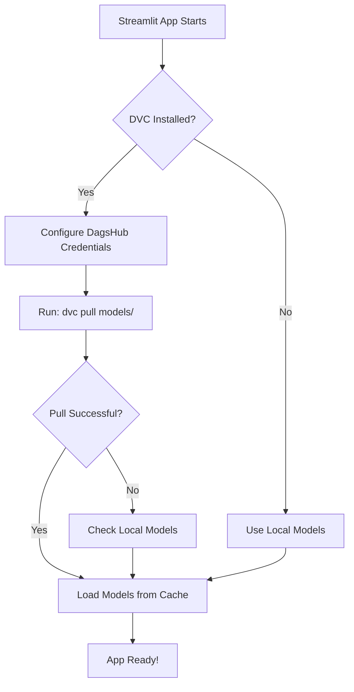

# 🚀 Streamlit Cloud Deployment Guide (Production-Grade with DVC)

## ✅ Prerequisites Completed

- [x] DVC configured with DagsHub remote
- [x] Model tracked by DVC (`dvc.yaml`)
- [x] Streamlit app updated with DVC pull logic
- [x] `.streamlit/config.toml` created
- [x] `.streamlit/secrets.toml` template created (gitignored)

---

## 📋 Step-by-Step Deployment to Streamlit Cloud

### Step 1: Push Code to GitHub

```bash
# Add all changes
git add .

# Commit changes
git commit -m "feat: Add production-grade DVC model deployment for Streamlit Cloud"

# Push to GitHub
git push origin main
```

### Step 2: Push Models to DVC Remote (DagsHub)

```bash
# Set DagsHub credentials (if not in .env)
$env:MLFLOW_TRACKING_USERNAME='rkpcode'
$env:MLFLOW_TRACKING_PASSWORD='your_dagshub_token'

# Push models to DVC remote
dvc push
```

**Verify on DagsHub**: Visit https://dagshub.com/rkpcode/customer_churn_prediction and check that models are uploaded.

### Step 3: Deploy to Streamlit Cloud

1. **Go to**: https://streamlit.io/cloud
2. **Sign in** with your GitHub account
3. **Click**: "New app"
4. **Configure**:
   - **Repository**: `rkpcode/customer_churn_prediction`
   - **Branch**: `main`
   - **Main file path**: `app/streamlit_app.py`
   - **Python version**: 3.9 or higher

### Step 4: Add Secrets to Streamlit Cloud

In the Streamlit Cloud dashboard, go to **App settings** → **Secrets** and add:

```toml
[dagshub]
username = "rkpcode"
token = "201d32ca3a0a16c3bb0b2ed46f019a714413c1f5"
```

> **Important**: Replace with your actual DagsHub token from https://dagshub.com/user/settings/tokens

### Step 5: Deploy!

Click **"Deploy"** and wait for the app to build and start.

---

## 🔍 How It Works

### DVC Model Loading Flow



### First Deployment
1. Streamlit Cloud builds the app
2. DVC pulls models from DagsHub (using credentials from secrets)
3. Models cached in Streamlit Cloud storage
4. App loads successfully

### Subsequent Runs
- Models already cached
- DVC skips download
- App starts faster

---

## 🧪 Local Testing

### Test DVC Pull Locally

```bash
# Remove local models to simulate fresh deployment
rm models/best_model.pkl
rm models/model_results.json

# Pull from DVC remote
dvc pull

# Run Streamlit app
streamlit run app/streamlit_app.py
```

### Test Without DVC (Fallback)

```bash
# Ensure models exist locally
python run_pipeline.py

# Run app (should use local models)
streamlit run app/streamlit_app.py
```

---

## 📊 Model Information

**Current Model**: LightGBM
- **Size**: 673 KB (best_model.pkl)
- **ROC-AUC**: 0.9991
- **Recall**: 98.42%
- **Precision**: 92.57%
- **F1-Score**: 0.9541

**Tracked Files**:
- `models/best_model.pkl` (via DVC)
- `models/model_results.json` (via DVC)
- `artifacts/imputation_values.json` (via Git)
- `artifacts/label_encoders.json` (via Git)

---

## 🐛 Troubleshooting

### Issue: "Model file not found"

**Solution**:
1. Check DVC remote: `dvc remote list`
2. Verify models pushed: `dvc push`
3. Check Streamlit secrets configured correctly
4. View Streamlit Cloud logs for DVC errors

### Issue: "DVC pull failed"

**Solution**:
1. Verify DagsHub credentials in Streamlit secrets
2. Check DagsHub repository access
3. Ensure `dvc` is in `requirements.txt` (already added)

### Issue: "Authentication failed"

**Solution**:
1. Generate new DagsHub token: https://dagshub.com/user/settings/tokens
2. Update `.streamlit/secrets.toml` locally
3. Update Streamlit Cloud secrets
4. Redeploy app

### Issue: "Slow first load"

**Expected behavior**: First deployment pulls ~673KB model from DagsHub (takes 10-30 seconds). Subsequent loads are instant (cached).

---

## 🔐 Security Best Practices

✅ **Implemented**:
- DagsHub credentials stored in Streamlit secrets (not in code)
- `.streamlit/secrets.toml` gitignored
- `.env` file gitignored
- Model files tracked by DVC (not in Git)

❌ **Never commit**:
- `.streamlit/secrets.toml`
- `.env` file
- DagsHub tokens in code
- Large model files to Git

---

## 📈 Monitoring & Updates

### Update Model

```bash
# Train new model
python run_pipeline.py

# Add to DVC
dvc add models/best_model.pkl

# Push to remote
dvc push

# Commit DVC file
git add models/best_model.pkl.dvc
git commit -m "Update model to v2.0"
git push

# Streamlit Cloud auto-redeploys and pulls new model
```

### Monitor App

- **Streamlit Cloud Dashboard**: View logs, metrics, and errors
- **DagsHub**: Track model versions and experiments
- **MLflow**: View training metrics and model performance

---

## 🎯 Production Checklist

- [x] DVC remote configured (DagsHub)
- [x] Models pushed to DVC remote
- [x] Streamlit app updated with DVC pull logic
- [x] Error handling and fallbacks implemented
- [x] Secrets configured (`.streamlit/secrets.toml`)
- [x] `.gitignore` updated
- [ ] Code pushed to GitHub
- [ ] Models verified on DagsHub
- [ ] Streamlit Cloud app deployed
- [ ] Secrets added to Streamlit Cloud
- [ ] App tested in production
- [ ] Documentation updated

---

## 🔗 Useful Links

- **Streamlit Cloud**: https://streamlit.io/cloud
- **DagsHub Repository**: https://dagshub.com/rkpcode/customer_churn_prediction
- **DagsHub Tokens**: https://dagshub.com/user/settings/tokens
- **DVC Documentation**: https://dvc.org/doc
- **Streamlit Secrets**: https://docs.streamlit.io/streamlit-community-cloud/deploy-your-app/secrets-management

---

## 📝 Next Steps

1. ✅ Complete local testing
2. → Push code to GitHub
3. → Push models to DVC remote
4. → Deploy to Streamlit Cloud
5. → Add secrets to Streamlit Cloud
6. → Test production deployment
7. → Share app URL with stakeholders

---

**Status**: ✅ Production-Ready with DVC
**Deployment Method**: Streamlit Cloud + DagsHub DVC Remote
**Model Versioning**: DVC + Git
